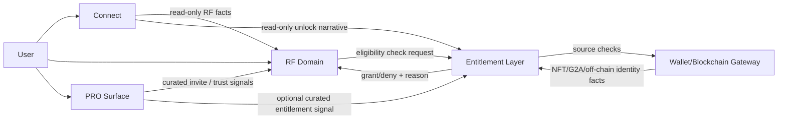

# RF Slice 6 - Premium Voucher / NFT Gate Design v1

## 1. Scope and Intent

This slice is an **architecture and bounded domain design pass**.

Goals:
- design a future-safe premium voucher model;
- define NFT-gate and entitlement abstractions;
- preserve RF ownership boundaries and Connect read-only role;
- avoid irreversible schema/runtime mistakes.

Non-goals:
- no blockchain runtime, minting, wallet sync, on-chain checks;
- no G2A runtime, payout/accounting, financial dashboards;
- no replacement of ordinary voucher runtime;
- no large refactors or destructive migrations.

---

## 2. Audit Findings

### 2.1 Current Readiness (what is already future-compatible)

1. **RF voucher lifecycle is explicit and canonical-aware**
   - `canonicalStatus` supports `available/locked/unlocked/redeemed/expired/cancelled`.
   - `statusChangedAt`, `repeatPolicySnapshot`, `issueSequence` give stable historical semantics.

2. **Repeatability model is already policy-oriented**
   - `once_per_scope` and `repeat_after_redeem` exist and are persisted as snapshots.
   - Consumption guards are scope-aware (`partner` vs `listing`).

3. **Attribution model is separated from financial runtime**
   - `attribution` payload and PRO-link attribution exist as independent concern.
   - This can be reused for premium visibility without economy coupling.

4. **Connect is already read-only RF consumer**
   - Connect pulls RF facts via summary/list endpoints and renders narrative/progress projections.
   - No RF writes from Connect.

5. **PRO baseline is established as relationship/visibility layer**
   - `rf_pro_link` and read-only partner visibility are live.
   - Explicitly no payouts/reward runtime in current PRO model.

### 2.2 Major Risks for Slice 6

1. **Ordinary and premium are not yet first-class separated in voucher classification**
   - Listing-offer kind (`basic/premium`) exists in listing mapping context, but RF voucher claim model is still ordinary-first.

2. **VIP/role-based gating can drift from future entitlement truth**
   - Current paid-ordinary gate uses role/economy assumptions; this is not a durable premium entitlement model.

3. **Premature coupling risk**
   - If RF starts reading wallet/NFT raw state directly, RF becomes dependent on blockchain/wallet internals.

4. **Vocabulary risk in user-facing layers**
   - Terms like wallet/reward/economy can leak into Connect and distort domain boundaries.

5. **Schema irreversibility risk**
   - Adding hard on-chain fields to `rf_voucher` too early can lock architecture into wrong ownership model.

### 2.3 Recommended Direction

- Keep RF as **voucher owner + claim/redemption owner**.
- Introduce entitlement as **external read abstraction**, not an RF-internal ledger.
- Treat NFT as one possible **entitlement source**, not mandatory RF core dependency.
- Keep Connect as narrative/progress projection with unlock signals, not economy dashboard.
- Keep PRO as curation/distribution/trust mediation, not payout engine.

### 2.4 Bounded Slice 6 Deliverable

1. Architecture design document (this file).
2. Optional, isolated experimental contracts/types for premium gate semantics.
3. No runtime behavior changes for ordinary vouchers.

---

## 3. Premium Voucher Domain Model (Conceptual)

Premium voucher remains an RF voucher, but with additional access semantics.

### 3.1 Classification

Minimal forward-compatible voucher classification:

- `ordinary` - current baseline voucher behavior.
- `premium` - special-access voucher requiring eligibility.

Optional future submodes (kept as policy metadata, not core type explosion):
- `invitation`
- `collectible_linked`
- `future_exclusive`

Design rule:
- keep core class count minimal (`ordinary` vs `premium`);
- encode fine-grained behavior in gate policy metadata.

### 3.2 Access Semantics

Premium access can be unlocked by one or more entitlement sources:
- NFT ownership / badge bridge (future source);
- PRO status or curated access;
- Connect progression milestones;
- partner whitelist/invitation;
- future G2A threshold (future source, not now);
- event participation.

### 3.3 Entitlement Abstraction

RF asks a neutral service:
- **Visibility eligibility**: should user see premium offer as available?
- **Claim eligibility**: can user claim now?

RF should not ask:
- wallet balances,
- token transfers,
- blockchain transaction state,
- minting details.

---

## 4. NFT Gate Design

### 4.1 What RF knows

RF receives only gate-level results:
- `granted` / `denied` / `pending`;
- gate source category (for explainability);
- optional user-facing reason code and expires-at metadata.

### 4.2 What RF does not know

RF must not depend on:
- chain id / contract calls;
- tx hashes and confirmations;
- wallet sync internals;
- mint/burn lifecycle.

### 4.3 Where NFT knowledge lives

NFT truth belongs outside RF:
- Wallet/Blockchain Gateway domain for on/off-chain state;
- Entitlement layer for normalized eligibility responses.

RF consumes entitlement decisions only.

---

## 5. Boundaries (RF / Connect / Wallet / Entitlement / PRO)

### 5.1 Domain Responsibilities

**RF (owner)**
- voucher definitions and lifecycle;
- claim/redeem rules and idempotency;
- partner offer constraints;
- premium claim invocation point (but not entitlement truth source).

**Connect (consumer)**
- narrative/progress projection;
- milestones and unlock storytelling;
- read-only reflection of RF activity.

**Wallet / Blockchain Gateway**
- NFT and G2A source-of-truth integration;
- chain-facing operations and sync.

**Entitlement layer**
- normalize eligibility checks from multiple sources;
- return stable grant/deny semantics to RF and other consumers.

**PRO**
- trust, curation, invitations, distribution assistance;
- read-only visibility and social mediation.

### 5.2 Interaction Model

Boundary rule:
- RF and Connect never call blockchain runtime directly.

---

## 6. Connect Implications (Slice 6 Design)

Connect may show:
- `premium access available` (narrative signal);
- `special access unlocked` milestones;
- premium-related RF activity summaries.

Connect must not show:
- wallet/token balances for premium logic;
- NFT speculation/market UX;
- payout/economy accounting semantics.

Suggested user-facing copy direction:
- "Специальный доступ открыт"
- "Премиум-доступ доступен"
- "Откройте условия в RF"

---

## 7. PRO Implications (Slice 6 Design)

PRO can contribute through non-financial mechanisms:
- curated partner invite flows;
- trust/reputation-backed access mediation;
- premium discovery and user onboarding.

Not in Slice 6:
- commissions, payouts, reward accounting.

---

## 8. Minimal Safe Preparations (This Slice)

Allowed now:
- architecture notes and explicit boundaries;
- isolated experimental type contracts;
- feature-flag placeholders (default off).

Not allowed now:
- runtime entitlement checks in claim path;
- schema migrations that enforce on-chain fields;
- wallet or blockchain integrations.

---

## 9. Risk Analysis

1. **Ownership drift risk**
   - If RF stores chain-specific details directly, RF ownership boundary blurs.

2. **Semantic drift risk**
   - If premium rules reuse ordinary-only assumptions (role-based VIP), future entitlement migration becomes expensive.

3. **UX drift risk**
   - If Connect starts rendering economy terms for premium gating, users perceive financialization before architecture is ready.

4. **Schema lock-in risk**
   - Hard-coding NFT/G2A ledger fields inside voucher runtime now can force backwards-incompatible migrations later.

5. **Operational coupling risk**
   - Direct runtime dependence on external chain services can degrade RF claim reliability.

---

## 10. Migration Strategy (Future Slices)

### Step A - Entitlement Contract Hardening
- finalize request/response contract for eligibility;
- define stable reason codes and cache semantics;
- keep RF integration behind feature flag.

### Step B - Premium Visibility (Read-only)
- add premium availability indicators in RF UI;
- no claim path enforcement yet;
- instrument diagnostics for denied eligibility counts.

### Step C - Premium Claim Guard
- enforce entitlement check in premium claim path only;
- ordinary path remains unchanged;
- fallback behavior for entitlement timeout/partial outage.

### Step D - Wallet/NFT Runtime Enablement
- activate entitlement source adapters (NFT, future G2A thresholds);
- keep adapter internals outside RF;
- run staged rollout per source with kill switches.

### Step E - Connect/PRO Enhancements
- Connect: unlock milestones and progress narratives;
- PRO: curated invite workflows and mediation signals;
- still no payout mechanics unless dedicated economy slice is approved.

---

## 11. Implementation Guardrails for Next Engineering Slice

- no new mandatory columns on `rf_voucher` for chain internals;
- no change to ordinary claim/redeem flow behavior by default;
- all premium gate behavior must be feature-flagged and opt-in;
- diagnostics remain internal; user-facing copy remains neutral and non-financial.

