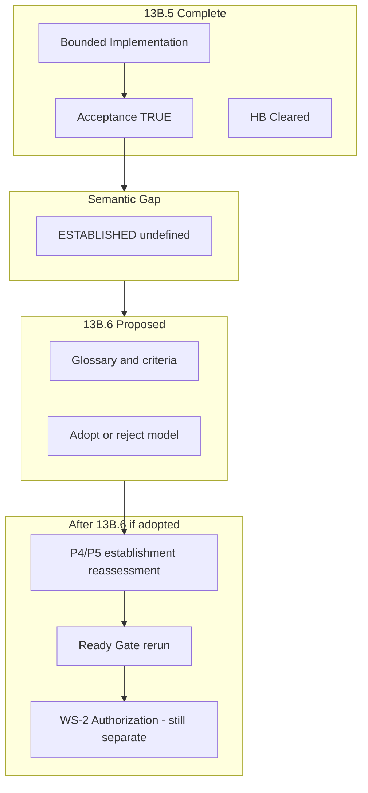

# Stage 13B.6 — Establishment Canon Synchronization

**Document class:** `SYNCHRONIZATION_CONTEXT_ONLY`  
**Not:** working slice · audit · review · implementation · gate verdict · canon amendment

**Scope lock:** This document **does not** change FT-X1, FT-X2, FT-X3, C2, program tokens, runtime literals, P4/P5 status labels, or any existing report. It **records context** for a possible future canon sub-branch.

---

## 1. Current Foundation Trio State

### 1.1 Program tokens (as of end of Stage 13B.5 — unchanged by this sync)

| Token | Value | Source gate |
| --- | --- | --- |
| `foundation_trio_accepted` | **TRUE** | Closure Acceptance — `FOUNDATION_TRIO_ACCEPTED_WITH_CONDITIONS` |
| `foundation_trio_ready` | **FALSE** | Ready Gate — `FOUNDATION_TRIO_READY_DEFERRED` |
| `ws2_authorized` | **FALSE** | Preserved across 13B.5 |
| `closure_outcome` | `BOUNDED_LAYER_ACCEPTED` | Closure Acceptance |

### 1.2 Named hard blockers (HB)

| HB | Status |
| --- | --- |
| Y-HB1 (E4) | **CLEARED** |
| Y-HB2 (persistence) | **CLEARED** |
| Y-HB3 (E9 contract) | **CLEARED** |
| Y-HB4 (BV) | **CLEARED** |
| Y-HB6 (VIS) | **CLEARED** |

**Note:** HB clearance ≠ `foundation_trio_ready` (Ready Gate explicit).

### 1.3 P4 / P5 operational tiers (13B.5 Establishment Review — unchanged)

| Tier | P4 Authorial Expression | P5 Source Reference |
| --- | --- | --- |
| IMPLEMENTED | **YES** | **YES** |
| PERSISTED | **YES** | **YES** |
| CONTRACTED | **YES** | **YES** |
| READ_VISIBLE | **YES** | **YES** |
| ESTABLISHED (canon tier) | **NO** | **NO** |

**Verdicts:** `P4_ESTABLISHMENT_DEFERRED`, `P5_ESTABLISHMENT_DEFERRED`.

### 1.4 Foundation Trio relationship (summary)

```
13B.5 bounded implementation + gates
  → Trio ACCEPTED (bounded layer)
  → Trio NOT READY (C2 §6.3; P4/P5 not ESTABLISHED)
  → WS-2 NOT authorized
  → Semantic gap on "ESTABLISHED" blocks honest next gate
```

---

## 2. Multi-Agent Findings

**Multi-agent mode:** activated. Seven roles; **individual findings only** (no merged agent summary).

| # | Agent | Finding IDs |
| --- | --- | --- |
| 1 | AI Program Director / Project Orchestrator | SYNC-ORCH-1..6 |
| 2 | Slice Strategist | SYNC-STRAT-1..5 |
| 3 | Runtime Governance Architect | SYNC-GOV-1..7 |
| 4 | Runtime Validation Agent | SYNC-VAL-1..5 |
| 5 | Backend Developer (review mode) | SYNC-BE-1..6 |
| 6 | QA Agent | SYNC-QA-1..5 |
| 7 | Technical Canon Writer | SYNC-CANON-1..7 |

### 2.1 AI Program Director / Project Orchestrator

- **SYNC-ORCH-1:** Stage **13B.5** delivered a **coherent bounded outcome** — acceptance YES, ready NO — program posture is **internally consistent**, not “stuck in failure.”
- **SYNC-ORCH-2:** The **next planned gate** after Establishment Review was **P4/P5 Establishment Implementation Authorization** — proceeding **without** a defined **ESTABLISHED** term risks **encoding ambiguity into CO-13/CO-S12 policy** and future agent playbooks.
- **SYNC-ORCH-3:** **13B.6** is justified as a **program sequencing** decision: **canon semantics before authorization-of-implementation**, not a retreat from Foundation Trio.
- **SYNC-ORCH-4:** Foundation Trio remains the **parent arc**; 13B.6 is a **lateral definition branch**, not a replacement for WS-1/WS-3/WS-5 workstreams.
- **SYNC-ORCH-5:** **WS-2 must stay closed** until ready token policy is separately satisfied — 13B.6 does not open WS-2.
- **SYNC-ORCH-6:** Recommends **launching full Stage 13B.6** (definition track) before **13B.5-style establishment implementation authorization**.

### 2.2 Slice Strategist

- **SYNC-STRAT-1:** P1–P3 use **`ESTABLISHED_BOUNDED`** in FT-X1/C2; P4/P5 use **`NOT_ESTABLISHED`** only — the ladder is **asymmetric** and **unexplained** in one glossary.
- **SYNC-STRAT-2:** **IMPLEMENTED ≠ ESTABLISHED** is enforced in code (`isP4ClassificationProof` vs `isAuthorialPostRuntimePrimitiveEstablished`) — but **governance docs never define** the word **ESTABLISHED** in one place.
- **SYNC-STRAT-3:** Skipping 13B.6 and opening an **implementation authorization gate** would force agents to **infer** establishment from **bounded evidence** — repeats 13B.5 deferral pattern with **unclear remediation checklist**.
- **SYNC-STRAT-4:** User hypothesis **IDEA → … → READY** is a **useful strawman** for 13B.6-A — must not auto-merge into FT-X1/C2.
- **SYNC-STRAT-5:** After 13B.6 (if adopted), **re-run order** should be: establishment verdict refresh (if criteria change) → **Ready Gate** — not Ready before definition.

### 2.3 Runtime Governance Architect

- **SYNC-GOV-1:** **C2 §4.2 step 13** (“Independent tokens: P4 and P5 `ESTABLISHED`”) **presupposes** a known meaning of **ESTABLISHED** — today it functions as a **boolean slot**, not a **defined criterion set**.
- **SYNC-GOV-2:** **E1 vs runtime** split (C2 R3, E1 matrix) implies **ESTABLISHED** is likely **governance-primary** with **runtime corroboration** — but this is **implicit**, not defined.
- **SYNC-GOV-3:** **CO-13 / CO-S12** literals are **downstream encodings** of a governance claim — changing them without **canon definition** is **unsafe** (false pass or false block).
- **SYNC-GOV-4:** **FT-X1 §6.1** stale wording (“until WS-3 authorization”) vs existing bounded runtime is a **symptom** of missing **establishment glossary**, not proof P4/P5 are already ESTABLISHED.
- **SYNC-GOV-5:** **False-pass catalog** (C2 F5, F16, F20) shows historical intent: **protect against premature victory** — that intent is **valid**; missing **positive definition** is the **new** failure mode.
- **SYNC-GOV-6:** **Keeping** undefined ESTABLISHED creates **governance paralysis** — agents defer correctly but cannot state **one missing artifact class**.
- **SYNC-GOV-7:** **Redefining** ESTABLISHED without ZR-style lock risks **canon drift** — 13B.6 must end in **explicit adoption or rejection**, not “soft consensus.”

### 2.4 Runtime Validation Agent

- **SYNC-VAL-1:** **176/176** tests support **bounded operational maturity** — they do **not** fail for lack of code; they **cannot** pass an undefined **ESTABLISHED** label.
- **SYNC-VAL-2:** Positive tests exist (classification, boundary proof, HTTP create/read) — confusion is **semantic**, not **test absence**.
- **SYNC-VAL-3:** No single test named “establishment tier acceptance” — whether that is **required** is a **13B.6 question**, not something validation can answer alone.
- **SYNC-VAL-4:** If 13B.6 defines ESTABLISHED as **governance-only**, validation role becomes **corroboration checklist** — if **product+runtime**, suite design must be **specified**.
- **SYNC-VAL-5:** Re-running Ready Gate **before** definition will **reproduce** `FOUNDATION_TRIO_READY_DEFERRED` — predictable, not a regression.

### 2.5 Backend Developer (review mode)

- **SYNC-BE-1:** Runtime **implements** P4/P5 bounded paths; module comments explicitly say **“without P4 establishment”** / **“without full P5 lifecycle establishment”** — code **knows** the gap is **tier naming**, not missing handlers.
- **SYNC-BE-2:** **`isAuthorialPostRuntimePrimitiveEstablished: false`** and **`isSourceReferenceRuntimePrimitiveEstablished: false`** are **intentional** — flipping them in a future slice **requires** canon criteria, not gate optimism.
- **SYNC-BE-3:** **Classification proof** and **boundary proof** are **not bugs** — they must not be renamed to “established” without glossary (overread risk **ER-EST-5** class).
- **SYNC-BE-4:** **Persistence + rehydration** satisfy **storage truth** — establishment, if governance-heavy, may still require **literal policy + spine step FILLED** beyond storage.
- **SYNC-BE-5:** Implementation Authorization Gate **without** 13B.6 would push engineers to **guess** when CO literals may become `true` — **high incident risk**.
- **SYNC-BE-6:** No backend change recommended in synchronization phase.

### 2.6 QA Agent

- **SYNC-QA-1:** **Acceptance** (slice PJR, E9, persistence) maps to user strawman **ACCEPTED** — **not** currently mapped to **ESTABLISHED** in canon.
- **SYNC-QA-2:** QA can certify **IMPLEMENTED** and **tested bounded behavior** — cannot certify **ESTABLISHED** until **acceptance criteria for that label** exist.
- **SYNC-QA-3:** **OpenAPI ≠ establishment** remains valid regardless of 13B.6 outcome — definition work must **preserve** this guard.
- **SYNC-QA-4:** Long-term (1–5 years), explicit **ESTABLISHED** could reduce **AI/human false promotion** of contract-only or persistence-only changes — **if** definition is **enforceable** (checklists, gate templates).
- **SYNC-QA-5:** If 13B.6 is skipped, QA will keep writing “bounded pass” reports that **sound like** establishment to casual readers — **documentation debt**.

### 2.7 Technical Canon Writer

- **SYNC-CANON-1:** **Synchronization ≠ canon change** — this file is **context only**; FT-X1/C2 tokens stay as-is until a future **13B.6 canon lock** stage (if any).
- **SYNC-CANON-2:** **Three-tier confusion** today: (a) operational YES/NO matrix, (b) `ESTABLISHED_BOUNDED` for WS-1 primitives, (c) `NOT_ESTABLISHED` for P4/P5 — readers conflate **maturity** with **label**.
- **SYNC-CANON-3:** Historical **ESTABLISHED** likely meant: **“safe to treat as foundational primitive in program claims”** — not merely **“code merged.”**
- **SYNC-CANON-4:** User hypothesis ladder is **compatible** with existing invariants (**Accepted ≠ Ready**, **Established ≠ Ready**, **Ready ≠ WS-2**) — **compatibility must be proven** in 13B.6-A, not assumed here.
- **SYNC-CANON-5:** **Term probably should be kept** (with definition) rather than retired — it already guards **ZR false-pass** intent; retirement would need **replacement guardrails**.
- **SYNC-CANON-6:** After 13B.6 adoption (if any), **P4/P5 status refresh** and **Ready Gate re-run** are **expected** — order: **definition lock → establishment reassessment → ready**.
- **SYNC-CANON-7:** **WS-2 stays closed** through all synchronization.

### 2.2 Cross-agent alignment (not a substitute for §2.1)

| Topic | Alignment |
| --- | --- |
| Root cause | **Missing glossary for ESTABLISHED**, not missing implementation |
| Skip 13B.6? | **Not recommended** |
| Change tokens now? | **No** |
| Open WS-2? | **No** |

**Disagreements:** None blocking. Minor tension: **SYNC-CANON-5** (keep term) vs hypothetical **retire term** direction — resolved in §7 by listing retire as **candidate**, not decision.

---

## 3. Problem Statement

### 3.1 Why Stage 13B.6 appears

After **13B.5**, the program hit a **semantic cliff**:

| Observation | Tension |
| --- | --- |
| P4/P5 are **operationally mature** (implement, persist, contract, read, test, accept) | FT-X1 §4.5 and C2 index still say **`NOT_ESTABLISHED`** |
| Agents **cannot honestly** assign **ESTABLISHED** | Agents **cannot enumerate** a **single missing proof type** — only a **scatter** of spine steps, CO literals, and stale §6.1 rows |
| Next gate on roadmap was **Establishment Implementation Authorization** | That gate would **operationalize** a term that is **not defined** |

**13B.6 exists to resolve definition debt before encoding more policy.**

### 3.2 What problem we are trying to solve

| Problem ID | Statement |
| --- | --- |
| **P-13B6-1** | **ESTABLISHED** is used as a **gate outcome** and **primitive tier** without a **single canonical definition**. |
| **P-13B6-2** | **Bounded maturity** is mistaken (by humans and AI) for **establishment** because **no intermediate label** is defined for P4/P5 (unlike P1–P3 **`ESTABLISHED_BOUNDED`**). |
| **P-13B6-3** | **Deferral is correct but non-actionable** — repeated DEFERRED verdicts without **definition** do not tell the program **what to build next** (policy vs code vs tests). |
| **P-13B6-4** | **Foundation Trio Ready** depends on **P4/P5 ESTABLISHED** (C2 §6.3) — undefined establishment **blocks the entire Trio rollup** even when WS-1 is complete. |

### 3.3 Why we do not continue immediately to P4/P5 Establishment Implementation Authorization Gate

| Reason | Explanation |
| --- | --- |
| **R-SEQ-1** | Authorization gates **encode** what “true” means for CO literals and spine step 13 — **encoding undefined terms** creates **irreversible false passes**. |
| **R-SEQ-2** | Implementation slice **without glossary** invites **literal flip** based on **test count** or **merge to main** — exactly what ZR/C2 false-pass rules were written to prevent. |
| **R-SEQ-3** | 13B.5 already proved **bounded evidence is insufficient** for **ESTABLISHED** — next step is **define sufficiency**, not **authorize more code** by default. |
| **R-SEQ-4** | Program credibility: stakeholders see **mature P4/P5** and ask “why not established?” — only **13B.6** can answer with **canon**, not another deferral report. |

**Synchronization position:** **Pause** establishment implementation authorization **until** 13B.6 definition track completes or **explicitly rejects** the need for definition (unlikely given evidence above).

### 3.4 How 13B.6 relates to Foundation Trio



**Foundation Trio** remains the **umbrella**: 13B.6 does not replace Trio doctrine; it **unblocks honest progression** on **WS-3 primitive tiers** that Trio readiness requires.

---

## 4. Historical Meaning of ESTABLISHED

### 4.1 What the existing canon likely intended (inferred — not adopted as new definition)

| Source signal | Likely historical intent |
| --- | --- |
| FT-X1 P4/P5 **“canon target only”** | **Do not treat post-transition primitives as won** until WS-3 proof chain complete |
| C2 **E1 NEVER-SUFFICIENT for establishment** | **Governance acceptance alone** cannot establish primitives |
| C2 **F16, F20** | **Negatives** and **shape inventory** must not substitute for **positive establishment** |
| **CO-13 / CO-S12** | Runtime must **not self-certify** establishment |
| **ESTABLISHED_BOUNDED** (P1–P3) | **Partial program victory** allowed for WS-1 — **different bar** than full **ESTABLISHED** |
| **Step 13 `[BLOCKED]`** | **Independent** P4/P5 tokens — anti-collapse of two primitives into one proof |

**Probable original meaning:**  
**ESTABLISHED** ≈ *“This primitive is a **foundational, post-transition runtime truth** in the ecosystem model; safe to reference in downstream architecture (e.g. Ready, WS-2 planning) without caveats.”*

**Not:** *“Code exists.”* *“Tests pass.”* *“OpenAPI has fields.”*

### 4.2 How the term drifted

| Drift | Effect |
| --- | --- |
| Bounded FT-3x slices delivered **real runtime** | Operational maturity **rose**; glossary **did not** |
| §6.1 “until WS-3 authorization” | Wording **aged out**; tier labels **did not** |
| Multiple proof booleans (`classification`, `boundary`, `primitive established`) | Engineers see **TRUE** flags and assume **ESTABLISHED** |
| **DEFERRED** verdicts without glossary | Correct safety, **poor explainability** |

### 4.3 User hypothesis (NOT ADOPTED — research input for 13B.6-A)

```text
IDEA → SPECIFIED → IMPLEMENTED → ACCEPTED → ESTABLISHED → READY
```

| Stage (hypothesis) | Rough mapping to today |
| --- | --- |
| IMPLEMENTED | P4/P5 **YES** today |
| ACCEPTED | 13B.5 slice acceptances + Trio **ACCEPTED** (bounded) |
| ESTABLISHED | **NO** — undefined |
| READY | `foundation_trio_ready` **FALSE** |

**This synchronization document does not adopt the ladder.**

---

## 5. Risks of Keeping Current Model

| ID | Risk | Horizon |
| --- | --- | --- |
| **RK-KEEP-1** | **Agent paralysis** — correct DEFERRED, unclear next action | Immediate |
| **RK-KEEP-2** | **False confidence** — “we shipped P4/P5” read as establishment | Immediate |
| **RK-KEEP-3** | **Foundation Trio stuck** at Ready FALSE despite HB cleared | 3–12 months |
| **RK-KEEP-4** | **Inconsistent tiers** — P1–P3 BOUNDED vs P4–P5 NOT only | 1–3 years |
| **RK-KEEP-5** | **AI false promotion** — models infer ESTABLISHED from contracts/tests | 1–5 years |
| **RK-KEEP-6** | **Canon credibility erosion** — labels diverge from observable system | 3–5 years |
| **RK-KEEP-7** | **Accidental literal flip** in a future slice without criteria | Immediate |

---

## 6. Risks of Redefining ESTABLISHED

| ID | Risk | Mitigation (for 13B.6-A) |
| --- | --- | --- |
| **RK-REDEF-1** | **Premature promotion** of P4/P5 if definition too weak | Require **ZR-style lock** + explicit reassessment gate |
| **RK-REDEF-2** | **Canon fork** — FT-X1/C2 disagree with new glossary | Single **adoption report** amends all references together |
| **RK-REDEF-3** | **Over-engineering** — huge checklist blocks velocity | Tier **ESTABLISHED_BOUNDED** option for P4/P5 |
| **RK-REDEF-4** | **Retirement of guard** — removing term without replacement | If retire, mandate **replacement false-pass rules** |
| **RK-REDEF-5** | **READY conflation** — ESTABLISHED defined as READY | Preserve invariants in §9 |
| **RK-REDEF-6** | **WS-2 leakage** — establishment opens propagation | Explicit **WS-2 still separate** in definition |
| **RK-REDEF-7** | **Retroactive relabel** of P1–P3 without migration plan | Include **WS-1 tier compatibility** in 13B.6-A |

---

## 7. Candidate Directions (for 13B.6-A research — not decisions)

| ID | Direction | Summary |
| --- | --- | --- |
| **DIR-A** | **Keep ESTABLISHED; define formally (governance-primary)** | ESTABLISHED = governed primitive tier with checklist (E-classes, gates, optional runtime literals policy) |
| **DIR-B** | **Keep ESTABLISHED; define as product+runtime composite** | Requires positive runtime path + governance acceptance + test contract |
| **DIR-C** | **Introduce ESTABLISHED_BOUNDED for P4/P5** | Align with P1–P3; full ESTABLISHED remains for Ready/WS-3 spine FILLED |
| **DIR-D** | **Split labels: GOVERNANCE_ESTABLISHED vs RUNTIME_ESTABLISHED** | Makes CO-13 semantics explicit; more complex for agents |
| **DIR-E** | **Retire ESTABLISHED; use ACCEPTED + READY only** | Simpler ladder; must rewrite C2 step 13 and FT-X1 §4.5 |
| **DIR-F** | **Rename to FOUNDATIONAL_PRIMITIVE_LOCKED** | New term, migration cost, clarity gain |

**Research questions (from program brief) mapped to 13B.6-A:**

| # | Question | Primary owner in 13B.6-A |
| --- | --- | --- |
| 1 | Need ESTABLISHED at all? | Canon Writer + Program Director |
| 2 | Exact definition? | Governance Architect + Canon Writer |
| 3 | Product vs governance state? | Governance Architect |
| 4 | Criteria for ESTABLISHED? | Strategist + Validation + QA |
| 5 | 1y / 3y / 5y benefits? | Program Director |
| 6 | AI/dev error protection? | QA + Backend review |
| 7 | Revisit P4/P5 then Ready Gate? | Program Director (expected **yes** if model adopted) |

---

## 8. Recommendation

### 8.1 Should full Stage 13B.6 be launched?

**YES — launch Stage 13B.6 (Establishment Canon definition track).**

| Criterion | Assessment |
| --- | --- |
| Problem is real? | **YES** — definition debt, not implementation debt |
| Cost of skip? | **HIGH** — repeated deferrals, risky authorization gate |
| Scope creep risk? | **Controllable** — 13B.6 is **glossary + criteria + adoption/reject**, not implementation |
| Trio impact? | **Positive** — unblocks honest P4/P5 → Ready path |

### 8.2 Should 13B.6-A start immediately after this sync?

**YES — recommended next artifact:** `Stage 13B.6-A — ESTABLISHED Definition & Adoption Gate` (or equivalent naming), with:

- explicit answer to Q1–Q7;
- choice among DIR-A..F (or hybrid);
- **adopt / adopt-with-conditions / reject** verdict on the user hypothesis ladder;
- **no** token or literal changes until a dedicated **canon lock** substage (if adoption).

### 8.3 What this synchronization explicitly does NOT do

| Item | Status |
| --- | --- |
| Change FT-X1 / C2 / tokens | **NO** |
| Change P4/P5 status | **NO** |
| Open WS-2 | **NO** |
| Grant ESTABLISHED / READY | **NO** |
| Authorize implementation | **NO** |

---

## 9. Next Safe Step

**Immediate (after this document):**

1. **Program kickoff: Stage 13B.6-A** — multi-agent **definition** work on **ESTABLISHED** (not implementation).
2. **Hold:** P4/P5 Establishment Implementation Authorization Gate.
3. **Hold:** Foundation Trio Ready Gate re-run.
4. **Hold:** WS-2 Authorization Gate.

**Expected sequence if 13B.6-A adopts a model:**

```text
13B.6-A definition lock
  → P4/P5 establishment reassessment (governance gate)
  → (optional) establishment implementation authorization + slices
  → Foundation Trio Ready Gate re-run
  → WS-2 Authorization Gate (still separate)
```

---

## 10. Synchronization Invariants

```
Synchronization ≠ canon change
Synchronization ≠ token change
Synchronization ≠ P4/P5 status change
Synchronization ≠ WS-2 open

Primitive Established ≠ Foundation Trio Ready   (until program says otherwise in 13B.6-A)
Foundation Trio Ready ≠ WS-2 Authorized
IMPLEMENTED / ACCEPTED ≠ ESTABLISHED            (until defined and granted)
```

---

## Execution Summary

| Field | Value |
| --- | --- |
| **Report file** | `docs/reports/stage_13B_6_establishment_canon_synchronization_v1.md` |
| **Agents used** | **7/7** (Program Director, Slice Strategist, Governance Architect, Validation, Backend review, QA, Canon Writer) |
| **Overall conclusion** | **13B.5 succeeded operationally; failed semantically on ESTABLISHED.** Definition debt blocks honest establishment and Ready progression. **Not a code problem.** |
| **Launch 13B.6?** | **YES** |
| **Launch 13B.6-A next?** | **YES** (definition & adoption gate) |
| **Pause** | Establishment Implementation Authorization · Ready re-run · WS-2 |
| **Tokens / canon / literals** | **Unchanged** by this document |
